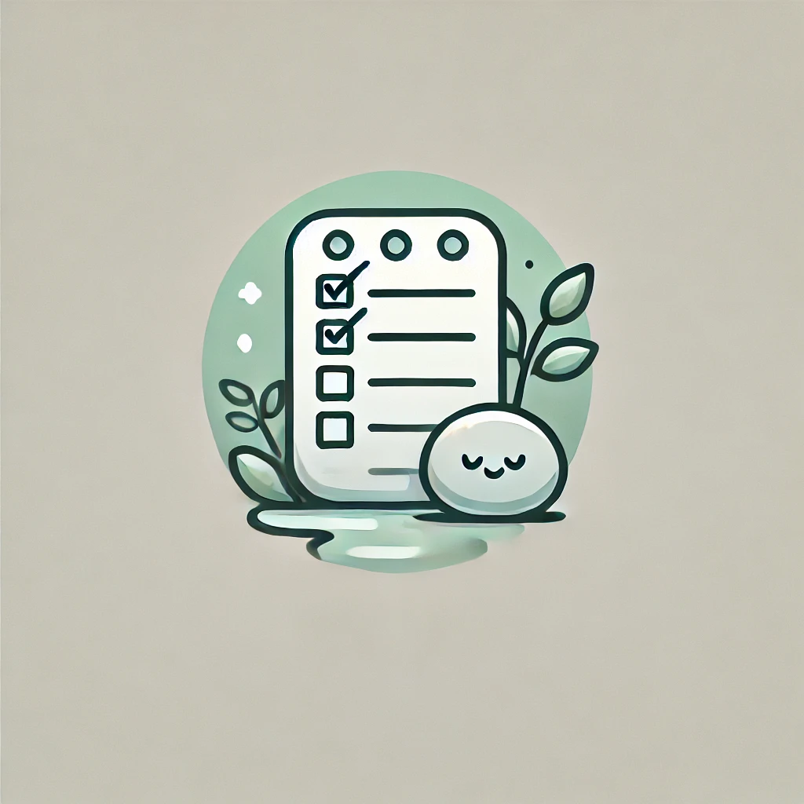

# ZenTasks



_"Your tasks... Your pace"_

---

### ZenTasks lightweight todo API

### Project Overview

Your task is to build **ZenTasks**, a To-Do API using Node.js, Express.js, and [Lowdb](https://github.com/typicode/lowdb) as a lightweight JSON-based database. This assignment will help you understand JavaScript concepts such as async/await, Promises, REST API conventions, and error handling while using a simple database.

---

### Project Requirements

You will create an API to manage two collections: **projects** and **todos**. These collections will be stored in a JSON file (`db.json`) using Lowdb. This file will persist between server restarts, simulating a lightweight database.

Your API should support the following features:

#### **1. Projects CRUDs**

- **Create a Project**: Add a new project.
- **Get All Projects**: Retrieve a list of all projects.
- **Update a Project**: Update the name of a project.
- **Delete a Project**: Delete a project by its ID. (Deleting a project should also delete all associated todos.)

#### **2. Todos CRUDs**

- **Create a Todo**: Add a new todo.
- **Get All Todos**: Retrieve a list of all todos.
- **Get Todo by ID**: Retrieve a specific todo if it exists in the database.
- **Get Todos for a Project**: Retrieve all todos associated with a specific project.
- **Update a Todo**: Update any/all fields of an existing todo.
- **Delete a Todo**: Delete a todo by its ID.

#### **3. Filtering and Sorting Todos**

The `GET /todos` endpoint will support filtering:

- **By priority**: Sort by ascending or descending priority.
- **By created date**: Sort by ascending or descending created date.

#### **4. API Validation**

- Enforce character limits on fields.
- Validate query parameters to ensure they are valid.
- Use `express-validator` as much as possible.
- Follow the specific requirements written in the code comments.

#### **5. Robust Error Handling**

- Handle most (if not all) edge cases that might cause errors.
- Use the proper [HTTP error codes](https://developer.mozilla.org/en-US/docs/Web/HTTP/Status).

---

### Collections

The main models/collection that ZenTask will work with.

#### **Projects**

```typescript
interface Project {
  id: string; // generated with uuidv4()
  title: string; // max length 256
  description: string; // max length 256
  todos: string[]; // contains the todo IDs of the todos in the project
  priorityScore?: number; // (optional) could be used to store the priority score instead of
  // computing it on every request
}
```

#### **Todos**

```typescript
interface Todo {
  id: string; // generated with uuidv4()
  title: string; // max length 256
  description: string; // max length 256
  priority: number; // number, only in the range 1-3
  project: string; // ID of the project to which the todo belongs
}
```

#### **'Database'**

The 'database' will be represented as an object with two arrays as follows:

```typescript
{ projects: [], todos: [] }
```

It will be contained in the `db.json` file. You can preview this file to ensure your database operations are correctly modifying the database.

---

### Validation

Most of the endpoint (body/params) validation will be handled by `validate.js` using Express **middleware** and `express-validator`. Add validations wherever possible to meet the constraints listed above and in the todos in the controller code.

For more details, refer to the [express-validator documentation](https://express-validator.github.io/docs/).

---

### Project Structure

```
todo-app/
├── src/
│   ├── routes/
│   │   ├── projects.js
│   │   ├── todos.js
│   ├── models/
│   │   ├── db.js
│   ├── middlewares/
│   │   ├── validate.js
│   ├── utils/
│   ├── app.js
├── .gitignore
├── db.json
├── package.json
├── package-lock.json
├── README.md
```

### **Scaffolding**

All the boilerplate code, dependencies, endpoint routing, and database/middleware/debug configuration are already provided in the current project scaffolding. Feel free to create any folders or files you need.

You can also install any other third-party npm packages you like, but the current project setup should have everything you need to get started.

The code scaffold is heavily commented with granular details and includes examples to help you understand the structure and logic.

---

### **Getting Started**

1. Start with the `POST` (create) endpoint for the **project** collection\*\* located in `src/routes/projects.js`.

   - This is a good starting point as you need to create a project to add todos to.

2. Continue with the `GET` endpoint for the **project** collection to retrieve a list of all projects.

3. Move on to the **todo** collection:
   - Implement the `POST` endpoint for todos.
   - Implement the `GET` endpoints for retrieving todos and filtering them.

The recommended order for implementing the endpoints is marked in the code with:

```js
// TODO:#1
```

This order is simply a guideline. Feel free to ignore it and work in the sequence that suits you best.

---

### Running the Project

1. Clone the repository using `git clone`.
2. Run `npm i` in the root of the project to install all dependencies.
3. Run `npm run dev` to start the webserver, which will be available on `http://localhost:3000`.

The project uses [nodemon](https://www.npmjs.com/package/nodemon), which watches your files for changes and reloads the app when modifications occur.

---

### **Good Luck!**
